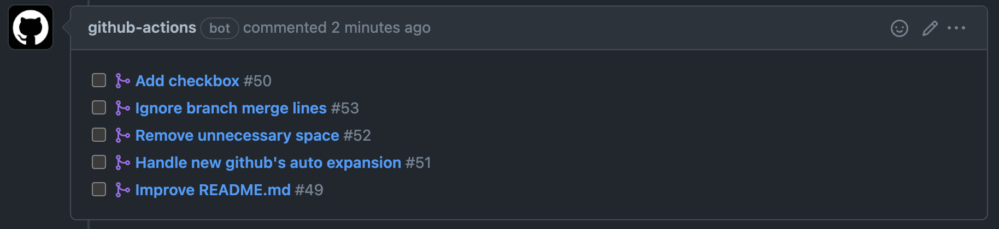

List Merged Pull Requests
===

This action lists merged pull requests on the source branch when a pull request is created.

## Example
You can see an example [here](https://github.com/tiwanari/list-merged-pull-requests/pull/30).



## Supported actions
- event: `pull_request`
- action: `opened` is recommended (to avoid duplicated comments)

## Inputs

### `token`

**Required** The GitHub Access Token.

## Outputs

None

## Sample workflow

```
name: list-merged-pull-requests example
on:
  pull_request:
    types: [opened]
    branches: [master]
jobs:
  example:
    name: Release management comment
    runs-on: ubuntu-latest
    steps:
      - name: Comment on PR
        uses: tiwanari/list-merged-pull-requests@master
        with:
          token: ${{ github.token }}
```

## License
MIT
